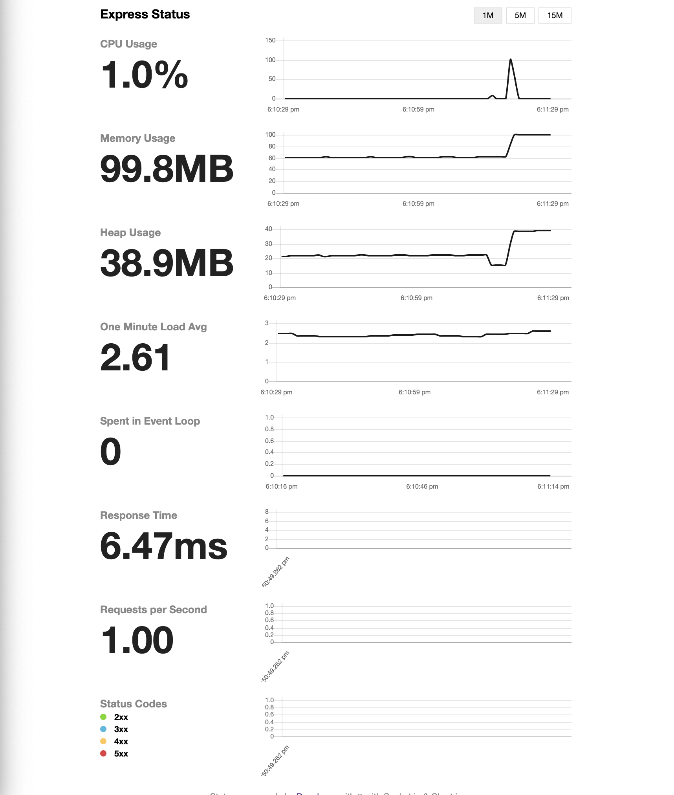
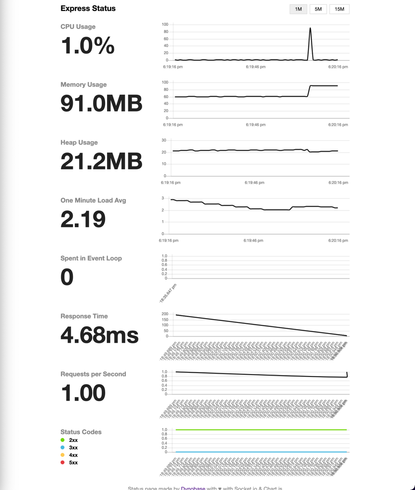

# A proof of concept to show differences between a cursor and offset approaches 
The main idea is to compare how many memories and resources the node.js server uses to generate a CSV file with lots of records. 

## Table of Contents

- [Quick start](#install)
- [Documentation](#documentation)


## Install
- Clone this repository:
```shell
  git clone https://github.com/pedchenkoroman/cursor-database-dev.to.git
```
- Run this command to set the database up:
```shell
  docker compose up -d
```
- Copy `config.example.json` file to the `config` folder and rename it `config.json`
```shell
  cp -i config.example.json config/config.json
```
> Please pay attention if you change some configuration variables in `docker-compose.yml` file do not forget to change it into the `config/config.json` file.

- Install dependency:
```shell
  npm install
```
- Start the server:
```shell
  npm start
```
- View the website at: http://localhost:3001/status You will see realtime metrics of your server. I use [express-status-monitor](https://www.npmjs.com/package/express-status-monitor)
- Last but not least please run the command to actually create a `Users` table in the database:
```shell
  npm run start:migration
```
And to fill the table with some data run the last one:
```shell
  npm run start:seed:all
```
> I use [RANDOM USER GENERATOR API](https://randomuser.me) 

## Documentation

First thing first I would like to say that I use [the json2csv package](https://www.npmjs.com/package/json2csv) to generate CSV from JSON.

1. The first solution that was on the top of my head to achieve the desired result is to take all records from the table
and then to generate a CSV file and send it. Let's open the `routers/user.router.js` file and take a look at a callback for `/csv` path.
First up I call the method `read` from the `user service` that returns all users, and then I call the synchronous method
`getParseSync` pass into all users and receive CSV which send to the front-end. So, navigate to the link `http://localhost:3001/users/csv` and you will see just a list of users.
Nothing fancy, but if you open the separate tab `http://localhost:3001/status` you will find runtime metrics. The image is number 1.
<div style="width: 1000px;">
    <figure style="width: 400px; height: 400px">
        
        <figcaption>The rest</figcaption>
    </figure>
    <figure style="width: 400px; height: 400px">
        
        <figcaption>First solution</figcaption>
    </figure>
</div>

2. The second implementation is to use a recursive function where to use offset to take users and write them to the response stream.
The implementation of this solution you can easily find into `routers/user.router.js` file and the callback for `/pagination/csv` path.
<div style="width: 1000px;">
    <figure style="width: 400px; height: 400px">
        
        <figcaption>The rest</figcaption>
    </figure>
</div>

3. Last but not least is to use a [cursor](https://www.postgresql.org/docs/current/sql-declare.html) approach from PostgresQL.
The implementation of this one you can easily find into `routers/user.router.js` file and the callback for `/cursor/csv` path.
The only one difference between this one and the second one is that I open transaction then declare the cursor and then fetch data from that. 
<div style="width: 1000px;">
    <figure style="width: 400px; height: 400px">
        
        <figcaption>The rest</figcaption>
    </figure>
</div>
